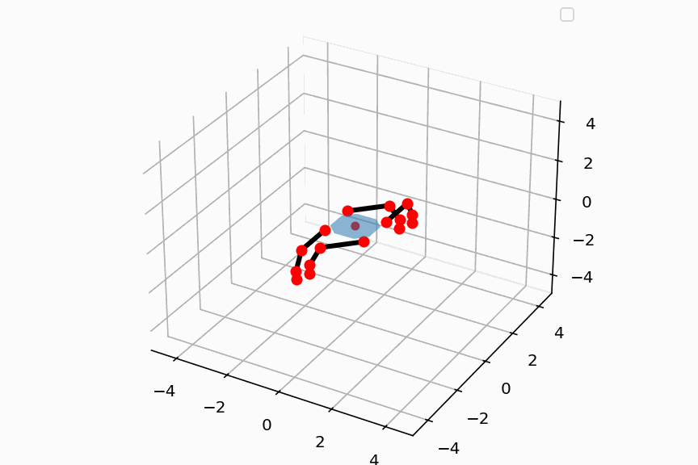
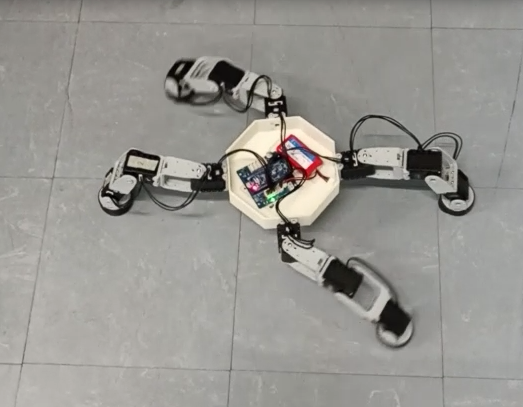

# Jumeau numérique cinématique d'un robot quadrupède
Ce projet s’inscrit dans un travail de groupe visant à concevoir et commander un robot quadrupède. Mon rôle consistait à concevoir les trajectoires que le robot devait réaliser, ainsi qu’à les exporter dans un format exploitable par la personne responsable de l’implémentation du code embarqué sur le robot.

Cela m’a conduit à développer un jumeau numérique cinématique du robot, utilisé pour la génération, l’évaluation et l’optimisation des trajectoires à l’aide d’un algorithme génétique.

#### Aucune bibliothèque dédiée à la robotique n’a été utilisée.
De plus, bien que le projet soit en groupe, le travail ici présent à été effectué seul avec une utilisation de l'I.A seulement pour le débugage.

#### Davantage de détails et de précisions sont dans le [rapport](Rapport.pdf)

## Objectifs :
- Réaliser un jumeau numérique cinématique du robot capable de suivre des trajectoires quelconques
- Evaluer quantitativement les trajectoires selon leur vitesse et leur stabilité
- Optimiser une trajectoire (via un algorithme génétique)
- Exporter une trajectoire sous deux formats .csv :
  - 1er format - Sauvegarde de la trajectoire pour réutilisation ultérieure par le programme
  - 2eme format - Exportation pour implémentation hardware

## Fonctionnalités principales :

Simulation de trajectoire :
- Simulation cinématique dans le domaine temporel et spatial
- Gestion de la synchronicité des pattes
- Possibilité d'enregistrer / de charger des trajectoires
- Exportation possible pour l'implémentation hardware
- Possibilité d'afficher la trajectoire par le biais d'un gif
- Grande variété de trajectoire créées possible

Evaluation et optimisation de trajectoire :
- Evaluation de la stabilité
- Evaluation de la vitesse
- Détection des trajectoires non valides
- Optimisation des trajectoires via algorithme génétique

## Résultats :

Voici une présentation des résultats pour la trajectoire en rotation. Une trajectoire initiale est d'abord définie (Figure 1), puis optimisée par application de l'algorithme génétique. L'on obtient alors une trajectoire optimisée (Figure 3) ainsi que l'évolution de la vitesse de rotation en fonction des générations (Figure 2). Enfin, l'on peut maintenant exporter la trajectoire pour l'implémenter sur le robot et observer le résultat (Vidéo 1, Table 1).

> Figure 1 - Simulation du robot effectuant la trajectoire initiale (ralenti)

> Figure 2 - Evolution de la vitesse moyenne des 5 meilleurs trajectoires en fonction des itérations

> Figure 3 - Simulation du robot effectuant une trajectoire optimisée (ralenti)

> Video 1 - Robot lors d'une rotation 

> Table 1 - Performance du robot lors des épreuves d'évaluation

| Epreuve  | Temps | Précision | Meilleure performance |
| ------------- | ------------- |  ------------- | ------------- |
| Sprint (3 m) | 25 s  | 15 cm  | Oui  |
| 360°  | 4.5 s  | < 3°  | Oui  |
